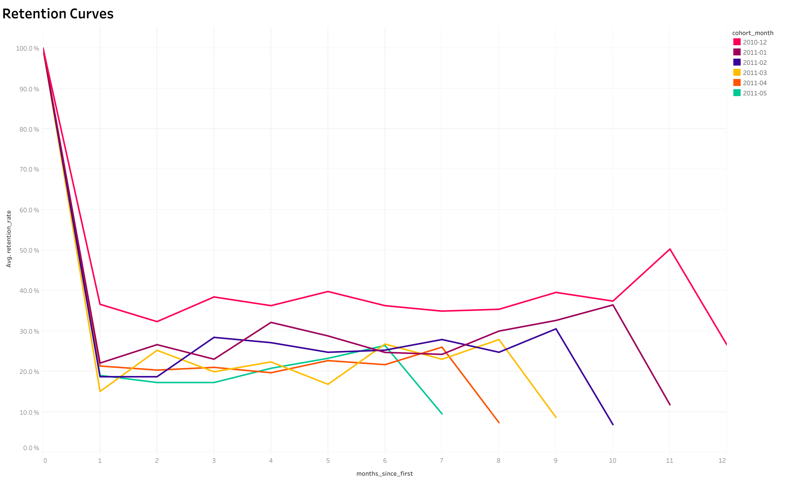

#   Когортный анализ и Retention клиентов

> Анализ паттернов удержания клиентов и lifetime value для оптимизации lifecycle маркетинга

---

##   Обзор проекта

Когортный анализ 13 когорт клиентов (Дек 2010 - Дек 2011) для выявления паттернов удержания и расчёта lifetime value.

### Ключевые вопросы:
- Какой % клиентов возвращается через 1, 3, 6 месяцев?
- Когда критическая точка оттока?
- Какова средняя Lifetime Value по когортам?

---

##   Ключевые находки

  **Критичный первый месяц** - 60-70% клиентов уходят после первой покупки  
  **Стабилизация на уровне 20-30%** к 3 месяцу - формирование "ядра" лояльных клиентов  
  **Ранние когорты в 10 раз ценнее** - LTV Дек 2010: $5,098 vs Дек 2011: $469  
  **Аномалия: Когорта Дек 2010** - retention 50.3% через 11 месяцев (праздничный эффект)

**Рекомендация:** Фокус на удержании в первый месяц - welcome-серия, скидка на 2-ю покупку

---

## 🛠 Технологии

- **SQL (BigQuery)** - Когортный анализ, расчёт retention, LTV
- **Tableau Public** - Интерактивные heatmaps и визуализации
- **Google Sheets** - Валидация данных

---

##   Визуализации

### Retention Heatmap

### Retention Curves

**[→ Открыть интерактивный дашборд](https://public.tableau.com/views/cohort_analysis_17652876649970/CustomerCohortAnalysisRetention?:language=en-US&:sid=&:redirect=auth&:display_count=n&:origin=viz_share_link)**

---

##   Результаты

**Retention Rate:**
- Месяц 0: 100%
- Месяц 1: 30-40% (падение 60-70%!)
- Месяц 3: 20-30% (стабилизация)
- Месяц 6+: 20-25% ("ядро" лояльных)

**LTV по когортам:**
- Ранние когорты (2010-12): $5,098
- Поздние когорты (2011-12): $469
- Фактор роста LTV со временем: 10x

---

##   Рекомендации

1. **Welcome-серия email** (день 3, 7, 14, 30) - увеличить retention месяца 1 с 30% до 40%
2. **Программа лояльности** для "ядра" (клиенты с 3+ покупками)
3. **Изучить когорту Дек 2010** - применить успешные паттерны к другим когортам

**Ожидаемый эффект:** +33% retention, +25% LTV

---

##   Контакты

**Ирина Дмитриева**
- 💼 LinkedIn: [Ваш профиль](https://www.linkedin.com/in/irinadm/)
- 📧 Email: irene.dm.alex@gmail.com
- 📊 Tableau: [Все дашборды](https://public.tableau.com/app/profile/irina.dmitrieva/vizzes)

---

##   Дополнительная информация

- **Использованные инструменты:** SQL, Tableau Public, Google Sheets, BigQuery
- **Демонстрируемые навыки:** Маркетинговая аналитика, Визуализация данных, SQL, Статистический анализ, Бизнес-стратегия
- **Длительность проекта:** 1 неделя
- **Источник данных:** Синтетические данные для демонстрации портфолио

---
